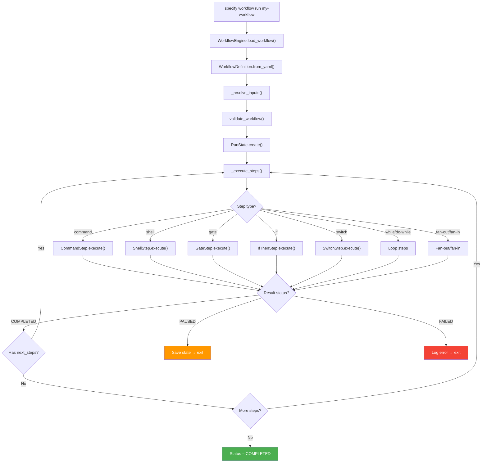
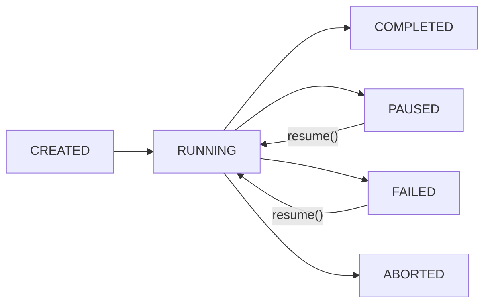
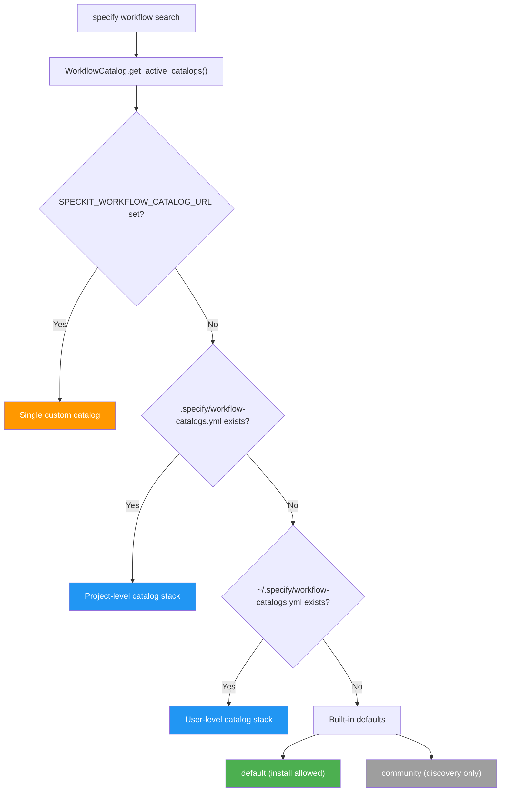

# Workflow System Architecture

This document describes the internal architecture of the workflow engine — how definitions are parsed, steps are dispatched, state is persisted, and catalogs are resolved.

For usage instructions, see [README.md](README.md).

## Execution Model

When `specify workflow run` is invoked, the engine loads a YAML definition, resolves inputs, and dispatches steps sequentially through the step registry:



### Sequential Execution

Steps execute sequentially. Each step receives a `StepContext` containing resolved inputs, accumulated step results, and workflow-level defaults. After execution, the step's output is stored in `context.steps[step_id]` and made available to subsequent steps via expressions like `{{ steps.specify.output.file }}`.

### Nested Steps (Control Flow)

Steps like `if`, `switch`, `while`, and `do-while` return `next_steps` — inline step definitions that the engine executes recursively via `_execute_steps()`. Nested steps share the same `StepContext` and `RunState`, so their outputs are visible to later top-level steps.

### State Persistence and Resume

The engine saves `RunState` to disk after each step, enabling resume from the exact point of interruption:



When a `gate` step pauses execution, the engine persists `current_step_index` and all accumulated `step_results`. On `specify workflow resume <run_id>`, the engine restores the context and continues from the paused step.

> **Note:** Resume tracking is at the top-level step index only. If a
> nested step (inside `if`/`switch`/`while`) pauses, resume re-runs
> the parent control-flow step and its nested body. A nested step-path
> stack for exact resume is a planned enhancement.

## Step Types

The engine ships with 10 built-in step types, each in its own subpackage under `src/specify_cli/workflows/steps/`:

| Type Key | Class | Purpose | Returns `next_steps`? |
|----------|-------|---------|-----------------------|
| `command` | `CommandStep` | Invoke an installed Spec Kit command via integration CLI | No |
| `prompt` | `PromptStep` | Send an arbitrary inline prompt to integration CLI | No |
| `shell` | `ShellStep` | Run a shell command, capture output | No |
| `gate` | `GateStep` | Interactive human review/approval | No (pauses in CI) |
| `if` | `IfThenStep` | Conditional branching (then/else) | Yes |
| `switch` | `SwitchStep` | Multi-branch dispatch on expression | Yes |
| `while` | `WhileStep` | Loop while condition is truthy | Yes (if true) |
| `do-while` | `DoWhileStep` | Loop, always runs body at least once | Yes (always) |
| `fan-out` | `FanOutStep` | Dispatch per item over a collection | No (engine expands) |
| `fan-in` | `FanInStep` | Aggregate results from fan-out | No |

## Step Registry

All step types register into `STEP_REGISTRY` via `_register_builtin_steps()` in `src/specify_cli/workflows/__init__.py`. The registry maps `type_key` strings to step instances:

```python
STEP_REGISTRY: dict[str, StepBase]  # e.g., {"command": CommandStep(), "gate": GateStep(), ...}
```

Registration is explicit — each step class is imported and instantiated. New step types follow the same pattern: subclass `StepBase`, set `type_key`, implement `execute()` and optionally `validate()`.

## Expression Engine

Workflow definitions use Jinja2-like `{{ expression }}` syntax for dynamic values. The expression engine in `src/specify_cli/workflows/expressions.py` supports:

| Feature | Syntax | Example |
|---------|--------|---------|
| Variable access | `{{ inputs.name }}` | Dot-path traversal into context |
| Step outputs | `{{ steps.plan.output.file }}` | Access previous step results |
| Comparisons | `==`, `!=`, `>`, `<`, `>=`, `<=` | `{{ count > 5 }}` |
| Boolean logic | `and`, `or`, `not` | `{{ items and status == 'ok' }}` |
| Membership | `in`, `not in` | `{{ 'error' not in status }}` |
| Literals | strings, numbers, booleans, lists | `{{ true }}`, `{{ [1, 2] }}` |
| Filter: `default` | `{{ val \| default('fallback') }}` | Fallback for None/empty |
| Filter: `join` | `{{ list \| join(', ') }}` | Join list elements |
| Filter: `contains` | `{{ text \| contains('sub') }}` | Substring/membership check |
| Filter: `map` | `{{ list \| map('attr') }}` | Extract attribute from each item |

**Single expressions** (`{{ expr }}` only) return typed values. **Mixed templates** (`"text {{ expr }} more"`) return interpolated strings.

### Namespace

The expression evaluator builds a namespace from the `StepContext`:

| Key | Source | Available when |
|-----|--------|----------------|
| `inputs` | Resolved workflow inputs | Always |
| `steps` | Accumulated step results | After first step |
| `item` | Current iteration item | Inside fan-out |
| `fan_in` | Aggregated results | Inside fan-in |

## Input Resolution

When a workflow is executed, `_resolve_inputs()` validates and coerces provided values against the `inputs:` schema:

| Declared Type | Coercion | Example |
|---------------|----------|---------|
| `string` | None (pass-through) | `"my-feature"` |
| `number` | `float()` → `int()` if whole | `"42"` → `42` |
| `boolean` | `"true"/"1"/"yes"` → `True` | `"false"` → `False` |
| `enum` | Validates against allowed values | `["full", "backend-only"]` |

Missing required inputs raise `ValueError`. Inputs with `default` values use the default when not provided.

## Catalog System



Catalogs are fetched with a 1-hour cache (per-URL, SHA256-hashed cache files in `.specify/workflows/.cache/`). Each catalog entry has a `priority` (for merge ordering) and `install_allowed` flag.

When `specify workflow add <id>` installs from catalog, it downloads the workflow YAML from the catalog entry's `url` field into `.specify/workflows/<id>/workflow.yml`.

## State and Configuration Locations

| Component | Location | Format | Purpose |
|-----------|----------|--------|---------|
| Workflow definitions | `.specify/workflows/{id}/workflow.yml` | YAML | Installed workflow definitions |
| Workflow registry | `.specify/workflows/workflow-registry.json` | JSON | Installed workflows metadata |
| Run state | `.specify/workflows/runs/{run_id}/state.json` | JSON | Persisted execution state |
| Run inputs | `.specify/workflows/runs/{run_id}/inputs.json` | JSON | Resolved input values |
| Run log | `.specify/workflows/runs/{run_id}/log.jsonl` | JSONL | Append-only event log |
| Catalog cache | `.specify/workflows/.cache/*.json` | JSON | Cached catalog entries (1hr TTL) |
| Project catalogs | `.specify/workflow-catalogs.yml` | YAML | Project-level catalog sources |
| User catalogs | `~/.specify/workflow-catalogs.yml` | YAML | User-level catalog sources |

## Module Structure

```
src/specify_cli/
├── workflows/
│   ├── __init__.py          # STEP_REGISTRY + _register_builtin_steps()
│   ├── base.py              # StepBase, StepContext, StepResult, StepStatus, RunStatus
│   ├── catalog.py           # WorkflowCatalog, WorkflowCatalogEntry, WorkflowRegistry
│   ├── engine.py            # WorkflowDefinition, WorkflowEngine, RunState, validate_workflow()
│   ├── expressions.py       # evaluate_expression(), evaluate_condition(), filters
│   └── steps/
│       ├── command/         # Dispatch command to AI integration
│       ├── shell/           # Run shell command
│       ├── gate/            # Human review checkpoint
│       ├── if_then/         # Conditional branching
│       ├── prompt/          # Arbitrary inline prompts
│       ├── switch/          # Multi-branch dispatch
│       ├── while_loop/      # While loop
│       ├── do_while/        # Do-while loop
│       ├── fan_out/         # Sequential per-item dispatch
│       └── fan_in/          # Result aggregation
└── __init__.py              # CLI commands: specify workflow run/resume/status/
                             #   list/add/remove/search/info,
                             #   specify workflow catalog list/add/remove
```
